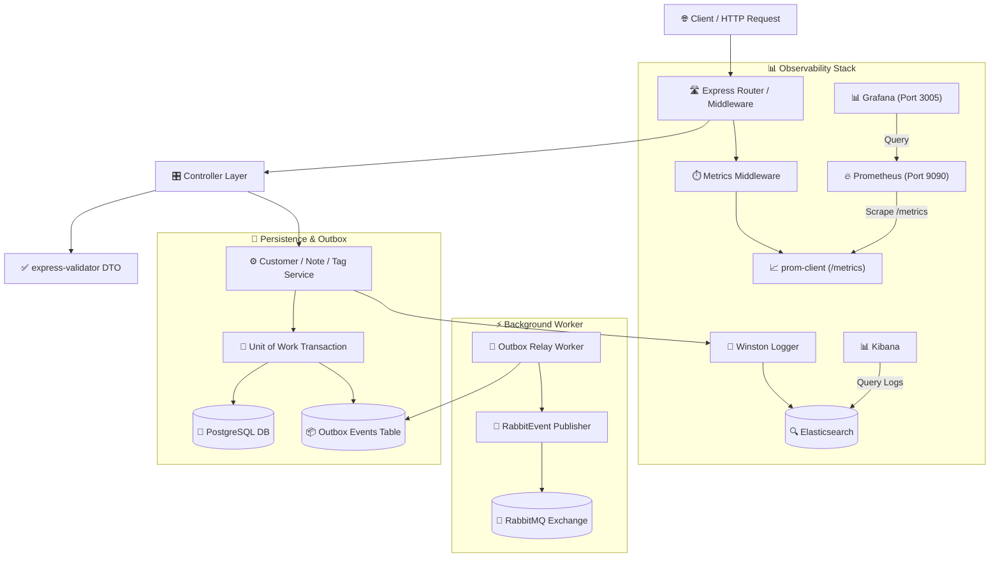
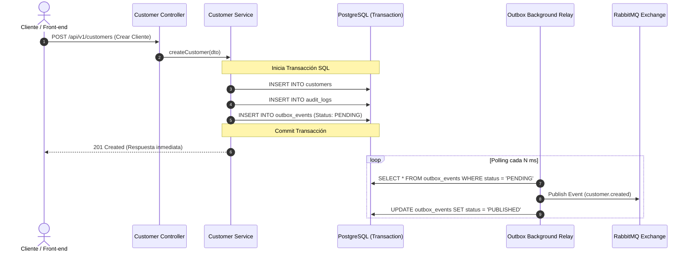

# 🏢 Customer Service - StreamCRM

Servicio centralizado para la gestión de clientes, notas, etiquetas, auditoría y cambios de estado en **StreamCRM**. Diseñado bajo principios de **Clean Architecture**, con persistencia transaccional en **PostgreSQL**, comunicación asíncrona mediante el patrón **Transactional Outbox** y **RabbitMQ**, y monitoreo continuo mediante **Prometheus** y **Grafana**.

---

## 📌 Tabla de Contenidos
- [Características Principales](#-características-principales)
- [Arquitectura del Microservicio](#-arquitectura-del-microservicio)
- [Diagramas de Arquitectura y Flujos](#-diagramas-de-arquitectura-y-flujos)
- [Estructura del Proyecto](#-estructura-del-proyecto)
- [Patrones de Diseño Implementados](#-patrones-de-diseño-implementados)
- [Rutas y API Endpoints](#-rutas-y-api-endpoints)
- [Monitoreo y Observabilidad](#-monitoreo-y-observabilidad)
- [Configuración y Variables de Entorno](#-configuración-y-variables-de-entorno)
- [Comandos y Ejecución](#-comandos-y-ejecución)

---

## ✨ Características Principales

- **Gestión Integral de Clientes**: Creación, actualización, búsqueda avanzada, cambio de estado y eliminación.
- **Notas y Auditoría**: Registro de notas asociadas a clientes e historial completo de auditoría (`AuditLogs`) e historial de estados (`CustomerStatusHistory`).
- **Etiquetado (Tags)**: Clasificación de clientes para mejor segmentación.
- **Transactional Outbox Pattern**: Garantía de consistencia eventual al registrar los eventos del dominio en la tabla `outbox_events` dentro de la misma transacción SQL antes de ser publicados a RabbitMQ.
- **Observabilidad y Métricas (Prometheus & Grafana)**: Recolección y exposición de métricas de rendimiento (RPS, latencia, CPU, memoria) mediante `prom-client` en el endpoint `/metrics`.
- **Log Centralizado**: Integración con **Winston** y **Elasticsearch** / **Kibana** para monitoreo y trazabilidad de logs.

---

## 🏗️ Arquitectura del Microservicio

El proyecto sigue una estructura por capas (Layered / Clean Architecture):

```text
┌──────────────────────────────────────────────────────────┐
│                   HTTP / Presentation                    │
│   (Express Routes, Controllers, express-validator)       │
└────────────────────────────┬─────────────────────────────┘
                             │
                             ▼
┌──────────────────────────────────────────────────────────┐
│                    Application Layer                     │
│    (Services, DTOs, Unit of Work, MetricsService)        │
└────────────────────────────┬─────────────────────────────┘
                             │
                             ▼
┌──────────────────────────────────────────────────────────┐
│                      Domain Layer                        │
│            (Entities, Interfaces, Enums)                 │
└────────────────────────────┬─────────────────────────────┘
                             │
                             ▼
┌──────────────────────────────────────────────────────────┐
│                Infrastructure & Data                     │
│ (PostgreSQL Repositories, Outbox Relay, Prometheus, ES)  │
└──────────────────────────────────────────────────────────┘
```

---

## 📐 Diagramas de Arquitectura y Flujos

### 1. Diagrama de Arquitectura General



### 2. Diagrama del Flujo Transactional Outbox



---

## 📂 Estructura del Proyecto

```text
src/
├── app.ts                  # Configuración de Express, middlewares, métricas y rutas
├── main.ts                 # Bootstrap de la aplicación y conexiones DB/Elasticsearch
├── background/             # Workers en segundo plano (Outbox Relay)
├── config/                 # Configuración de entorno (env, postgres, elasticsearch, rabbitmq)
├── controllers/            # Controladores HTTP (Customer, Note, Tag, MetricsController)
├── dto/                    # Objetos de Transferencia de Datos
├── entity/                 # Entidades del dominio (Customer, Note, Tag, AuditLogs, OutBoxEvent)
├── enum/                   # Enums del sistema (CustomerStatus, Events, etc.)
├── interfaces/             # Contratos e interfaces de repositories y servicios
├── publisher/              # Implementaciones de Event Publishers (RabbitMQ, Console)
├── repository/             # Implementación de acceso a datos con PostgreSQL
├── responses/              # Formateadores estandarizados de respuestas HTTP
├── routes/                 # Rutas de Express para cada recurso (customer, tag, notes, metrics)
├── services/               # Lógica de negocio principal (Customer, Note, Tag, MetricsService)
├── shared/                 # Middlewares globales (client-info, logger, error-handler)
└── validators/             # Reglas de validación con express-validator
```

---

## 🧩 Patrones de Diseño Implementados

1. **Transactional Outbox Pattern**: Evita fallos de consistencia entre la base de datos SQL y el broker de mensajes RabbitMQ.
2. **Repository Pattern**: Abstrae las consultas SQL tras interfaces para desacoplar el motor de base de datos de la lógica de negocio.
3. **Unit of Work**: Gestiona transacciones compuestas para garantizar la atomicidad en operaciones complejas (ej. Crear Cliente + Auditoría + Outbox Event).
4. **DTO (Data Transfer Object)**: Valida y transporta únicamente la información requerida en cada petición HTTP.
5. **Observability Middleware**: Mide automáticamente la duración y frecuencia de cada petición HTTP (`MetricsController.metricsCounter`) mediante histogramas y contadores.

---

## 🛣️ Rutas y API Endpoints

### 👤 Clientes (`/api/v1/customers`)
- `POST /` - Crear un nuevo cliente.
- `GET /` - Listar clientes con paginación y filtros.
- `GET /:id` - Obtener detalle de cliente por ID.
- `PUT /:id` - Actualizar información del cliente.
- `PATCH /:id/status` - Cambiar estado del cliente (Active, Inactive, Blocked).
- `DELETE /:id` - Eliminar cliente.

### 📝 Notas (`/api/v1/notes`)
- `POST /` - Agregar una nota a un cliente.
- `GET /` - Consultar notas filtradas por cliente.
- `DELETE /:id` - Eliminar nota.

### 🏷️ Etiquetas (`/api/v1/tags`)
- `POST /` - Crear etiqueta.
- `GET /` - Listar etiquetas.
- `DELETE /:id` - Eliminar etiqueta.

### 📊 Métricas y Observabilidad (`/metrics`)
- `GET /metrics` - Exposición de métricas en formato texto de Prometheus (`prom-client`).

### 🩺 Healthcheck
- `GET /health` - Estado de salud del microservicio.

---

## 📊 Monitoreo y Observabilidad

El servicio integra **Prometheus** y **Grafana** para monitoreo de métricas en tiempo real:

1. **Métricas del Sistema (Default Metrics)**:
   - Uso de CPU, memoria Heap y RSS del proceso Node.js.
   - Latencia del Event Loop y estado del Garbage Collector.
   - Cantidad de handles y sockets activos.

2. **Métricas Personalizadas HTTP**:
   - `http_requests_total`: Contador total de peticiones HTTP con etiquetas de `method`, `route` y `status`.
   - `http_request_duration_seconds`: Histograma de latencia en segundos con buckets configurados (`[0.05, 0.1, 0.3, 0.5, 1, 2, 5]`).

3. **Arquitectura de Monitoreo**:
   - **Prometheus Container (Puerto `9090`)**: Realiza scraping cada 5 segundos al endpoint `/metrics`.
   - **Grafana Container (Puerto `3005`)**: Visualización gráfica de peticiones por segundo (RPS), tasa de errores y percentiles de latencia (p95, p99).

---

## ⚙️ Configuración y Variables de Entorno

Crear un archivo `.env` en la raíz de `apps/customer-service/` con el siguiente contenido base:

```env
NODE_ENV=development
SERVER_PORT=3000

# PostgreSQL
DB_HOST=localhost
DB_PORT=5433
DB_USER=streamCRMServerAdmin
DB_PASSWORD=admin
DB_NAME=postgres

# RabbitMQ
RABBITMQ_URL=amqp://localhost:5673

# Elasticsearch
ELASTICSEARCH_NODE=http://localhost:9200
```

---

## 🚀 Comandos y Ejecución

```bash
# Navegar al microservicio
cd apps/customer-service

# Ejecutar en modo desarrollo
pnpm dev

# Compilar TypeScript a JavaScript
pnpm build

# Iniciar servidor compilado en producción
pnpm start

# Ejecutar tests unitarios e integración
pnpm test
```
