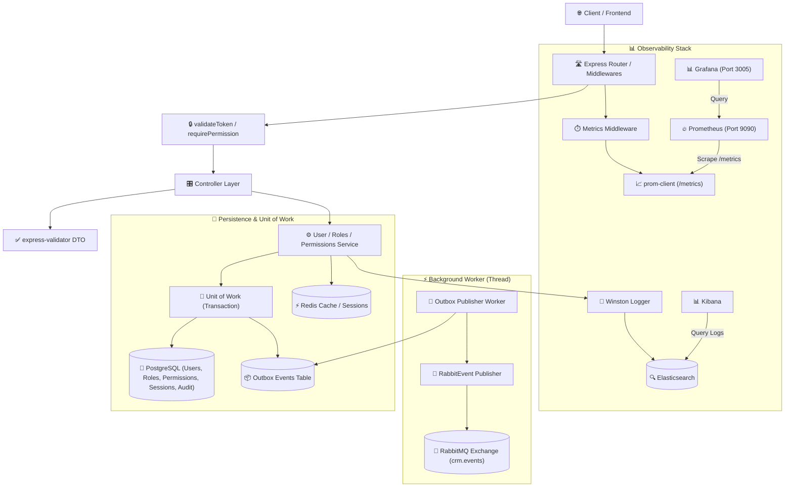
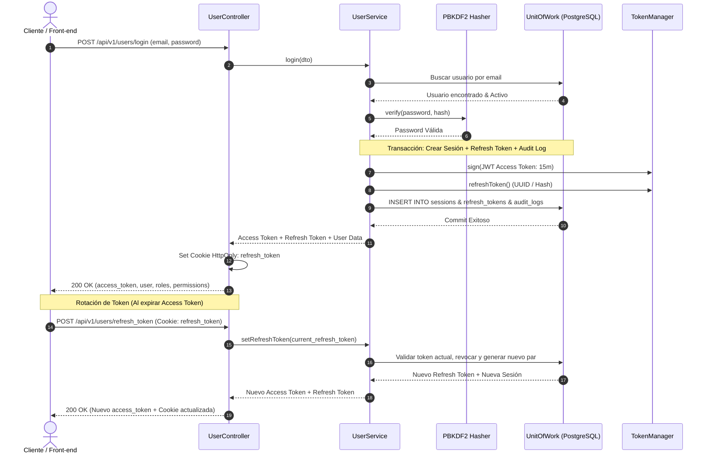
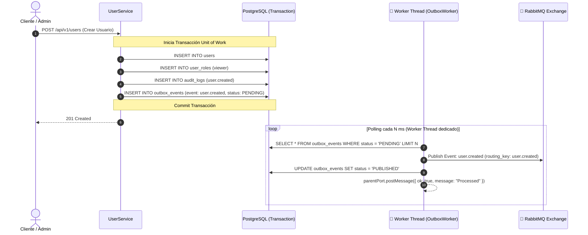

# 🔐 Auth Service - StreamCRM

Servicio centralizado de **Autenticación, Autorización y Gestión de Identidad (IAM)** en **StreamCRM**. Diseñado bajo principios de **Clean Architecture**, proporciona control de acceso granular basado en roles y permisos (**Dynamic RBAC**), gestión de sesiones y tokens (**JWT + Refresh Tokens rotativos con persistencia en PostgreSQL y Redis**), auditoría exhaustiva de seguridad (`audit_logs`), y comunicación asíncrona mediante el patrón **Transactional Outbox** ejecutado en un **Worker Thread** dedicado hacia **RabbitMQ**, respaldado con observabilidad continua mediante **Prometheus**, **Grafana** y **Elasticsearch**.

---

## 📌 Tabla de Contenidos
- [Características Principales](#-características-principales)
- [Arquitectura del Microservicio](#-arquitectura-del-microservicio)
- [Diagramas de Arquitectura y Flujos](#-diagramas-de-arquitectura-y-flujos)
- [Estructura del Proyecto](#-estructura-del-proyecto)
- [Patrones de Diseño Implementados](#-patrones-de-diseño-implementados)
- [Eventos Emitidos](#-eventos-emitidos)
- [Rutas y API Endpoints](#-rutas-y-api-endpoints)
- [Monitoreo y Observabilidad](#-monitoreo-y-observabilidad)
- [Configuración y Variables de Entorno](#-configuración-y-variables-de-entorno)
- [Comandos y Ejecución](#-comandos-y-ejecución)

---

## ✨ Características Principales

- **Autenticación Segura y Gestión de Sesiones**: Hashing criptográfico con PBKDF2 (`node:crypto`), emisión de **Access Tokens (JWT)** de corta duración y **Refresh Tokens** persistidos en base de datos con rotación automática y revocación de sesiones.
- **Control de Acceso Dinámico (RBAC - Role-Based Access Control)**: Evaluación en tiempo real de roles y permisos granulares asignados a usuarios y roles, protegidos mediante middleware `requirePermission()`.
- **Transaccionalidad con Unit of Work**: Operaciones complejas ejecutadas de forma atómica en PostgreSQL (ej. creación de usuario + rol por defecto + permisos + evento outbox + auditoría).
- **Transactional Outbox Pattern en Worker Threads**: Registro seguro de eventos en la tabla `outbox_events` y despacho asíncrono hacia **RabbitMQ** mediante un `Worker Thread` desacoplado del hilo principal.
- **Trazabilidad y Auditoría Completa (`audit_logs`)**: Registro de dirección IP, User-Agent, entidad afectada, acción ejecutada y deltas de cambios (`old_values` y `new_values`) en cada acción sensible.
- **Observabilidad y Métricas (Prometheus & Grafana)**: Recolección y exposición de métricas de proceso y peticiones HTTP (`http_requests_total`, `http_request_duration_seconds`) mediante `prom-client` en `/metrics`.
- **Logging Estructurado Centralizado**: Envío de logs a **Elasticsearch** y visualización en **Kibana** mediante **Winston**.

---

## 🏗️ Arquitectura del Microservicio

El servicio sigue una arquitectura por capas desacoplada con persistencia relacional transaccional y procesamiento en segundo plano:

```text
┌──────────────────────────────────────────────────────────┐
│                   HTTP / Presentation                    │
│   (Express Routes, Controllers, express-validator, Auth) │
└────────────────────────────┬─────────────────────────────┘
                             │
                             ▼
┌──────────────────────────────────────────────────────────┐
│                    Application Layer                     │
│  (UserService, RolesService, PermissionsService, Metrics)│
└────────────────────────────┬─────────────────────────────┘
                             │
                             ▼
┌──────────────────────────────────────────────────────────┐
│                      Domain Layer                        │
│            (Entities, Interfaces, Enums, DTOs)           │
└────────────────────────────┬─────────────────────────────┘
                             │
                             ▼
┌──────────────────────────────────────────────────────────┐
│             Infrastructure & Persistence                 │
│  (UnitOfWork, PostgreSQL Repositories, Redis, PBKDF2)    │
└────────────────────────────┬─────────────────────────────┘
                             │
                             ▼ (Outbox DB Table)
┌──────────────────────────────────────────────────────────┐
│              Outbox Relay (Worker Thread)                │
│    (Polling outbox_events -> RabbitMQ Event Publisher)   │
└──────────────────────────────────────────────────────────┘
```

---

## 📐 Diagramas de Arquitectura y Flujos

### 1. Diagrama de Arquitectura General



### 2. Diagrama de Autenticación, Emisión y Rotación de Tokens



### 3. Diagrama del Flujo Transactional Outbox (Worker Thread)



---

## 📂 Estructura del Proyecto

```text
apps/auth-service/src/
├── app.ts                  # Configuración de Express, middlewares globales y montaje de rutas
├── main.ts                 # Bootstrap de la aplicación, conexiones DB, Redis, ElasticSearch
├── background/             # Procesamiento asíncrono en segundo plano
│   └── events/             # Worker Thread dedicado para Transactional Outbox Relay
├── config/                 # Conexiones (PostgreSQL, Redis, RabbitMQ, Elastic, UnitOfWork, env)
├── controllers/            # Controladores HTTP (User, Roles, Permissions, Metrics)
├── dto/                    # Data Transfer Objects para validación de entrada
│   ├── auditLog/           # DTOs de auditoría
│   ├── event/              # DTOs de eventos
│   ├── permission/         # DTOs de permisos y roles (SetNewPermissions, etc.)
│   ├── session/            # DTOs de sesiones y refresh tokens
│   └── user/               # DTOs de usuarios (CreateUser, Login, etc.)
├── entity/                 # Entidades del dominio (User, Role, Permission, Session, OutboxEvent)
├── enum/                   # Enumeraciones del sistema (UserStatus, RoleStatus, EntityType, ErrorCodes)
├── interfaces/             # Contratos e interfaces de servicios, repositorios y tokens
├── publisher/              # Implementaciones de publicación de eventos (RabbitMQ, Console)
├── repository/             # Implementaciones de persistencia con PostgreSQL
│   ├── auditLog/           # AuditLogsRepository
│   ├── permission/         # PermissionRepository, RolePermissionRepository
│   ├── session/            # SessionRepository, RefreshTokenRepository
│   └── user/               # UserRepository, RoleRepository, UserRoleRepository, OutboxEventRepository
├── responses/              # Definición de respuestas tipadas del sistema
├── routes/                 # Definición de routers de Express (users, roles, permissions, metrics)
├── services/               # Lógica de negocio (UserService, RolesService, PermissionsService, MetricsService)
├── shared/                 # Utilidades comunes, middleware de JWT, RBAC, logger y manejo de errores
│   ├── factory/            # ErrorFactory y manejadores estándar
│   ├── middleware/         # validateToken, requirePermission, validateRequest, clientInfo
│   ├── types/              # Tipos genéricos y constantes de eventos
│   └── utils/              # PBKDF2 PasswordHasher, TokenManager, WinstonLogger
└── validators/             # Reglas de validación con express-validator (auth, user, permission)
```

---

## 🧩 Patrones de Diseño Implementados

1. **Unit of Work Pattern (`UnitOfWork`)**: Coordina la escritura de múltiples repositorios (`users`, `userRoles`, `permissions`, `events`, `auditLogs`) dentro de una única transacción SQL en PostgreSQL, garantizando atomicidad y rollback total ante fallos.
2. **Transactional Outbox Pattern**: Evita problemas de doble escritura distribuidas (*Dual-Write Problem*) guardando los eventos de dominio en la tabla `outbox_events` dentro de la transacción de negocio, antes de ser despachados a RabbitMQ.
3. **Worker Thread IPC Bridge**: Aislamiento del polling de eventos de outbox en un hilo secundario (`Worker Thread`), comunicando resultados o errores al hilo principal mediante `parentPort.postMessage()`.
4. **Dynamic RBAC (Role-Based Access Control)**: Middleware reutilizable `requirePermission(code)` que verifica dinámicamente si el usuario autenticado cuenta con el permiso activo requerido en la base de datos.
5. **Token Rotation & Session Management**: Patrón de rotación continua de Refresh Tokens con invalidación de sesiones previas ante sospechas de reutilización.
6. **Repository Pattern**: Desacoplamiento total entre las consultas SQL y la lógica de negocio de los servicios mediante abstracciones e interfaces (`IDatabase`).
7. **Observability Pattern (Prometheus & Elasticsearch)**: Middleware automático para métricas de latencia y contador de peticiones HTTP, junto con logs estructurados para Elasticsearch.

---

## 🔔 Eventos Emitidos

| Evento | Descripción | Payload Principal |
| :--- | :--- | :--- |
| `user.created` | Emisión al registrar un nuevo usuario en la plataforma | `id`, `external_id`, `email`, `first_name`, `last_name`, `status` |
| `user.updated` | Actualización de perfil o datos de usuario | `id`, `external_id`, `email`, cambios de perfil |
| `user.status.changed` | Cambio de estado de cuenta (active, inactive, blocked) | `id`, `prevStatus`, `currentStatus`, `user_id` |
| `user.logged_in` | Registro de inicio de sesión exitoso | `id`, `email`, `session_id`, `ip_address`, `user_agent` |
| `user.logged_out` | Cierre voluntario de sesión y revocación de token | `id`, `session_id`, `ip_address` |
| `user.set_roles` | Actualización de roles asignados a un usuario | `user_id`, `roles`, `current_user_id` |
| `user.set_permissions` | Asignación y actualización de permisos por rol | `user_id`, `role_id`, `permissions` |

---

## 🛣️ Rutas y API Endpoints

### 👤 Usuarios y Autenticación (`/api/v1/users`)

| Método | Endpoint | Descripción | Middlewares / Validación |
| :--- | :--- | :--- | :--- |
| `POST` | `/api/v1/users` | Crea un nuevo usuario en la plataforma | `validateToken`, `createUserValidator`, `validateRequest` |
| `GET` | `/api/v1/users/me` | Obtiene el perfil completo del usuario autenticado, con roles y permisos | `validateToken` |
| `POST` | `/api/v1/users/filtered` | Búsqueda avanzada y listado paginado de usuarios | `validateToken`, `getUsersValidator`, `validateRequest` |
| `POST` | `/api/v1/users/login` | Inicia sesión, genera JWT y establece cookie HttpOnly de Refresh Token | `loginValidator`, `validateRequest` |
| `POST` | `/api/v1/users/refresh_token` | Rota el Refresh Token y genera un nuevo Access Token JWT | `refreshTokenValidator`, `validateRequest`, `refreshTokenMiddleware` |
| `POST` | `/api/v1/users/logout` | Cierra la sesión activa y revoca el refresh token | `logoutValidator`, `validateRequest` |
| `PATCH` | `/api/v1/users/status/:id` | Modifica el estado de un usuario (`active`, `inactive`, `blocked`) | `validateToken`, `SetStatusUserValidator`, `validateRequest` |

#### 📝 Detalle de Endpoints de Usuarios:

1. **`POST /api/v1/users/login`**
   - **Body (JSON)**:
     ```json
     {
       "email": "admin@streamcrm.com",
       "password": "Password123!"
     }
     ```
   - **Respuesta (200 OK)**:
     ```json
     {
       "success": true,
       "response": {
         "details": {
           "access_token": "eyJhbGciOiJIUzI1NiIsInR5cCI6IkpXVCJ9...",
           "refresh_token": "a1b2c3d4-e5f6-7890-abcd-ef1234567890",
           "expires_at": 1726950000,
           "user": {
             "id": 1,
             "external_id": "9b1deb4d-3b7d-4bad-9bdd-2b0d7b3dcb6d",
             "email": "admin@streamcrm.com",
             "first_name": "Admin",
             "last_name": "User",
             "status": "active"
           },
           "roles": [
             { "id": 3, "name": "admin" }
           ],
           "permissions": [
             "customers.read",
             "customers.create",
             "users.read",
             "roles.read"
           ]
         }
       }
     }
     ```

2. **`GET /api/v1/users/me`**
   - **Headers**: `Authorization: Bearer <access_token>`
   - **Respuesta (200 OK)**:
     ```json
     {
       "success": true,
       "response": {
         "details": {
           "user": {
             "id": 1,
             "external_id": "9b1deb4d-3b7d-4bad-9bdd-2b0d7b3dcb6d",
             "email": "admin@streamcrm.com",
             "first_name": "Admin",
             "last_name": "User",
             "status": "active"
           },
           "roles": [{ "id": 3, "name": "admin" }],
           "permissions": ["customers.read", "customers.create", "users.read"]
         }
       }
     }
     ```

---

### 🛡️ Gestión de Roles (`/v1/roles`)

| Método | Endpoint | Descripción | Middlewares / Validación |
| :--- | :--- | :--- | :--- |
| `GET` | `/v1/roles` | Lista todos los roles disponibles en el sistema | `validateToken` |
| `PATCH` | `/v1/roles/:userid` | Reemplaza los roles asignados a un usuario específico | `validateToken`, `SetUserRolesValidator`, `validateRequest`, `requirePermission("roles.manage")` |

#### 📝 Detalle de Endpoints de Roles:

1. **`PATCH /v1/roles/:userid`**
   - **Headers**: `Authorization: Bearer <access_token>`
   - **Body (JSON)**:
     ```json
     {
       "roles": [1, 2],
       "status": "active"
     }
     ```
   - **Respuesta (200 OK)**:
     ```json
     {
       "success": true,
       "response": {
         "message": "Roles actualizados correctamente"
       }
     }
     ```

---

### 🔑 Gestión de Permisos (`/v1/permissions`)

| Método | Endpoint | Descripción | Middlewares / Validación |
| :--- | :--- | :--- | :--- |
| `GET` | `/v1/permissions` | Lista todos los permisos registrados en el catálogo | `validateToken` |
| `PATCH` | `/v1/permissions/:userid` | Asigna y actualiza los permisos asociados al rol de un usuario | `validateToken`, `SetNewPermissionsValidator`, `validateRequest`, `requirePermission("roles.manage")` |

#### 📝 Detalle de Endpoints de Permisos:

1. **`PATCH /v1/permissions/:userid`**
   - **Headers**: `Authorization: Bearer <access_token>`
   - **Body (JSON)**:
     ```json
     {
       "role_id": 2,
       "status": "active",
       "permissions": [
         { "code": "customers.read" },
         { "code": "customers.create" },
         { "code": "tickets.read" }
       ]
     }
     ```
   - **Respuesta (200 OK)**:
     ```json
     {
       "success": true,
       "response": {
         "message": "Permisos actualizados correctamente"
       }
     }
     ```

---

### 📊 Métricas y Observabilidad (`/metrics`)
- `GET /metrics` - Exposición de métricas del proceso Node.js y peticiones HTTP en formato estándar de Prometheus.

---

### 🩺 Healthcheck (`/health`)
- `GET /health` - Verificación del estado de salud del servicio.
  ```json
  {
    "success": true,
    "service": "auth-service",
    "status": "ok"
  }
  ```

---

## 📊 Monitoreo y Observabilidad

El microservicio está instrumentado con **Prometheus**, **Grafana** y **Elasticsearch**:

1. **Métricas por Defecto (`collectDefaultMetrics`)**:
   - Estadísticas del proceso Node.js (CPU, Heap usado/total, RSS, Event Loop lag).
   - Uso de memoria por Garbage Collector y sockets de red activos.

2. **Métricas Personalizadas HTTP**:
   - `http_requests_total`: Contador total de peticiones HTTP en el servicio con etiquetas de `method`, `route` y `status`.
   - `http_request_duration_seconds`: Histograma de tiempo de respuesta de peticiones HTTP en segundos (`[0.05, 0.1, 0.3, 0.5, 1, 2, 5]`).

3. **Arquitectura de Métricas en Docker**:
   - **Prometheus Container (Puerto `9090`)**: Scrapea `http://host.docker.internal:3000/metrics` periódicamente.
   - **Grafana Container (Puerto `3005`)**: Permite la visualización de dashboards en tiempo real para tasas de error, solicitudes por segundo (RPS) y latencia p95/p99.
   - **Elasticsearch (Puerto `9200`) & Kibana (Puerto `5601`)**: Indexación y análisis centralizado de logs de auditoría y operaciones de autenticación.

---

## ⚙️ Configuración y Variables de Entorno

Crear un archivo `.env` en la raíz de `apps/auth-service/`:

```env
NODE_ENV=dev
SERVER_PORT=3000
API_VERSION=1
SERVICE_NAME=auth-service

# PostgreSQL
DB_HOST=localhost
DB_PORT=5433
DB_USER=streamCRMServerAdmin
DB_PASSWORD=admin
DB_NAME=postgres

# Redis
REDIS_HOST=localhost
REDIS_PORT=6379
REDIS_PASSWORD=12345
REDIS_USERNAME=
REDIS_MAX_RETRIES_PER_REQUEST=3

# RabbitMQ & Outbox Worker
RABBITMQ_HOST=localhost
RABBITMQ_HOST_PORT=5673
RABBITMQ_USER=guest
RABBITMQ_PASSWORD=guest
RABBITMQ_VHOST=/
INTERVAL_WORKER_EXECUTION_TIME=5000
PAGINATION_RECORD_EVENTS_LIMIT=10

# Security & Tokens
HASH_PASSWORD_SECRET_KEY=tu_clave_secreta_pbkdf2
JWT_SECRET=tu_secreto_super_seguro_jwt_streamcrm
ACCESS_TOKEN_TTL=15m
REFRESH_TOKEN_TTL_DAYS=7
SESSION_TTL_DAYS=7

# Elasticsearch & Logging
ELASTIC_SEARCH_URL=http://localhost:9200
INDEX_ELASTIC_SEARCH_NAME=auth-service-logs
```

---

## 🚀 Comandos y Ejecución

```bash
# Navegar al microservicio
cd apps/auth-service

# Ejecutar en modo desarrollo
pnpm dev

# Compilar TypeScript a JavaScript
pnpm build

# Iniciar servidor compilado en producción
pnpm start

# Ejecutar tests unitarios e integración
pnpm test
```
