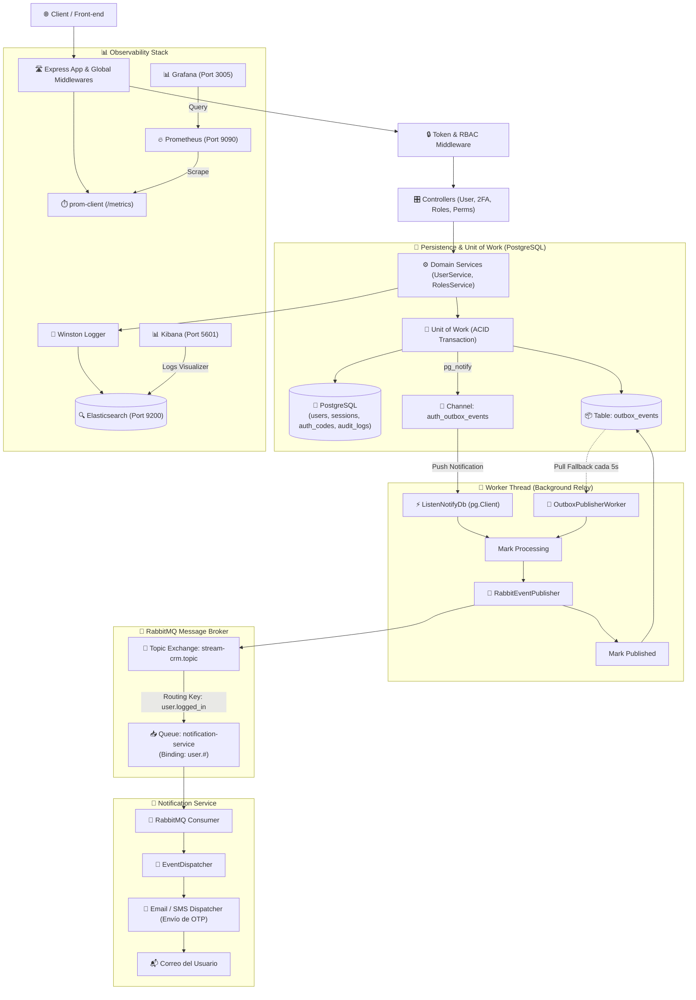
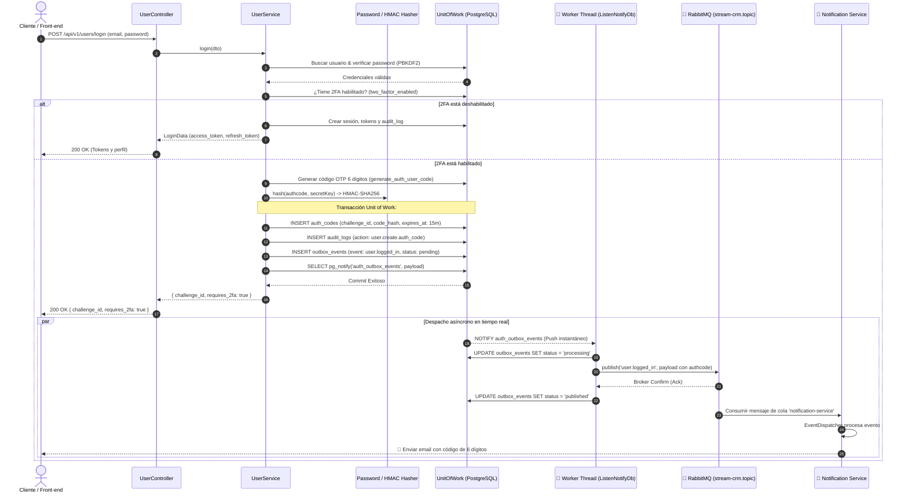
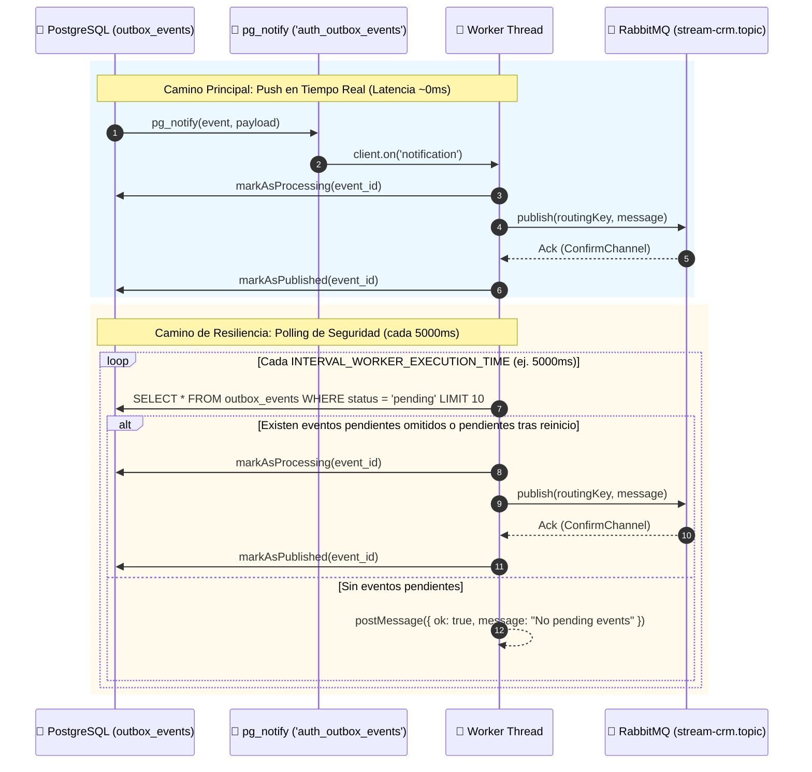
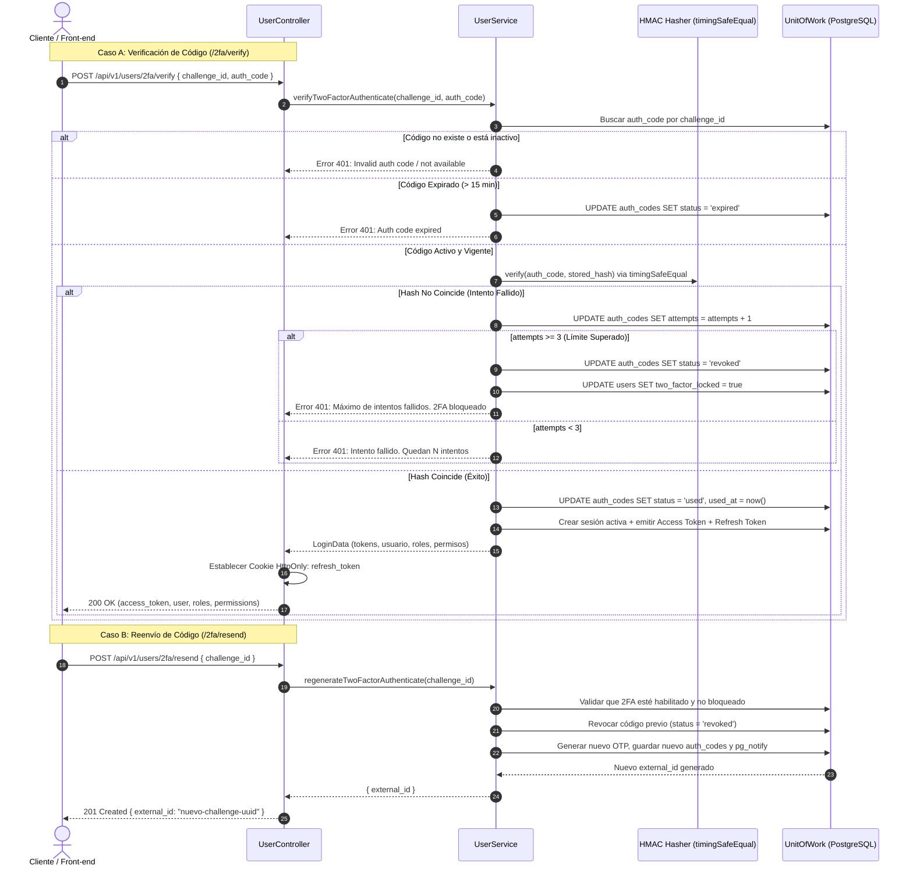
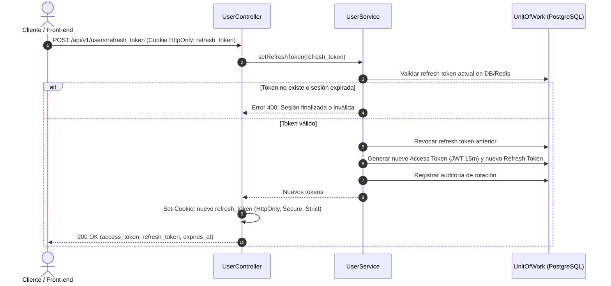
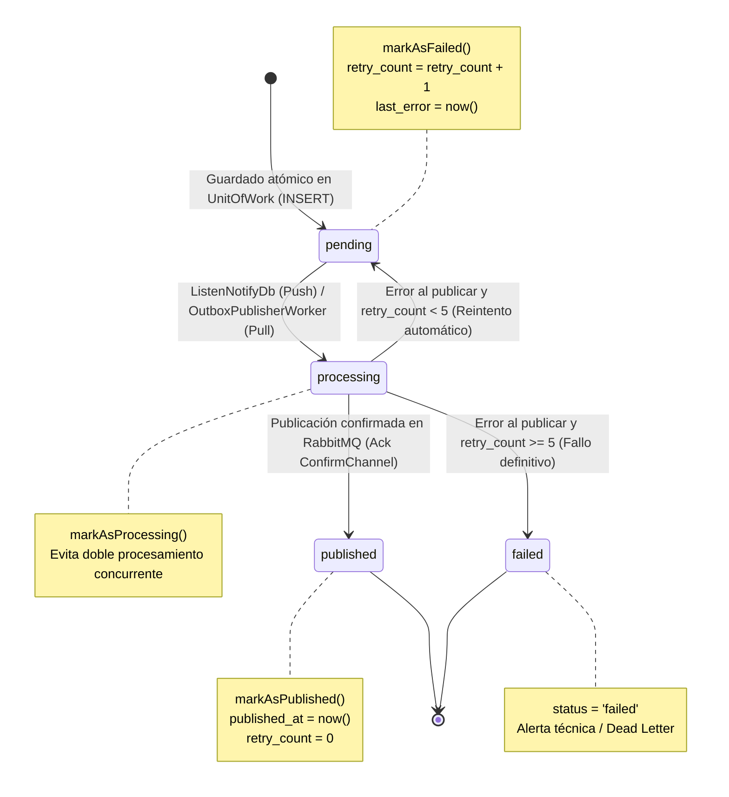

# 🔐 Auth Service - StreamCRM

Servicio centralizado de **Autenticación, Autorización y Gestión de Identidad (IAM)** en **StreamCRM**. Diseñado bajo principios de **Clean Architecture**, proporciona control de acceso granular basado en roles y permisos (**Dynamic RBAC**), gestión de sesiones y tokens (**JWT + Refresh Tokens rotativos con persistencia en PostgreSQL y Redis**), autenticación de dos factores (**2FA / OTP con HMAC-SHA256 y protección contra fuerza bruta**), auditoría exhaustiva de seguridad (`audit_logs`), y despacho de eventos en tiempo real mediante una arquitectura híbrida de **PostgreSQL LISTEN / NOTIFY** y **Transactional Outbox Polling** ejecutada en un **Worker Thread** dedicado hacia **RabbitMQ**, cuyos eventos son consumidos por **Notification Service** para entrega multicanal al usuario final. Todo respaldado con observabilidad continua mediante **Prometheus**, **Grafana** y **Elasticsearch / Kibana**.

---

## 📌 Tabla de Contenidos
- [Características Principales](#-características-principales)
- [Arquitectura del Microservicio](#-arquitectura-del-microservicio)
- [Diagramas de Arquitectura y Flujos](#-diagramas-de-arquitectura-y-flujos)
  - [1. Diagrama de Arquitectura General e Integración](#1-diagrama-de-arquitectura-general-e-integración)
  - [2. Flujo de Autenticación 2FA (Challenge-Response) y Notificación](#2-flujo-de-autenticación-2fa-challenge-response-y-notificación)
  - [3. Flujo Híbrido Outbox: PostgreSQL LISTEN/NOTIFY + Polling Fallback](#3-flujo-híbrido-outbox-postgresql-listennotify--polling-fallback)
  - [4. Flujo de Verificación y Resend de Código 2FA](#4-flujo-de-verificación-y-resend-de-código-2fa)
  - [5. Rotación de Tokens y Sesiones Activas](#5-rotación-de-tokens-y-sesiones-activas)
- [Estructura del Proyecto](#-estructura-del-proyecto)
- [Patrones de Diseño Implementados](#-patrones-de-diseño-implementados)
- [Eventos Emitidos e Integración con Notification Service](#-eventos-emitidos-e-integración-con-notification-service)
  - [Máquina de Estados del Evento Outbox (StatusEvent)](#-máquina-de-estados-del-evento-outbox-statusevent)
- [Rutas y API Endpoints](#-rutas-y-api-endpoints)
  - [👤 Usuarios y Autenticación 2FA (`/api/v1/users`)](#-usuarios-y-autenticación-2fa-apiv1users)
  - [🛡️ Gestión de Roles (`/api/v1/roles`)](#️-gestión-de-roles-apiv1roles)
  - [🔑 Gestión de Permisos (`/api/v1/permissions`)](#-gestión-de-permisos-apiv1permissions)
  - [📊 Métricas y Observabilidad (`/metrics`)](#-métricas-y-observabilidad-metrics)
  - [🩺 Healthcheck (`/health`)](#-healthcheck-health)
- [Monitoreo y Observabilidad](#-monitoreo-y-observabilidad)
- [Configuración y Variables de Entorno](#-configuración-y-variables-de-entorno)
- [Comandos y Ejecución](#-comandos-y-ejecución)

---

## ✨ Características Principales

- **Autenticación Robusta y Gestión de Sesiones**: Hashing criptográfico de contraseñas con PBKDF2 (`node:crypto`), emisión de **Access Tokens (JWT)** de corta duración (15 min) y **Refresh Tokens** persistidos en base de datos con rotación automática, revocación de sesiones concurrentes y almacenamiento en cookies `HttpOnly` seguras.
- **Autenticación en Dos Pasos (2FA / OTP)**:
  - Generación de códigos numéricos de 6 dígitos mediante procedimiento almacenado en PostgreSQL (`generate_auth_user_code()`).
  - Hashing criptográfico del OTP con **HMAC-SHA256** (`HmacSecretHasher`) y validación en tiempo constante (`crypto.timingSafeEqual`) para evitar ataques de temporización (*Timing Attacks*).
  - Ventana de expiración de 15 minutos por código de desafío (`challenge_id`).
  - Protección activa contra fuerza bruta: limitación estricta a 3 intentos fallidos con bloqueo automático del 2FA del usuario (`two_factor_locked = true`).
  - Flujo de reenvío controlado (`/2fa/resend`) que revoca códigos previos y emite nuevos desafíos.
- **Control de Acceso Dinámico (RBAC - Role-Based Access Control)**: Evaluación en tiempo real de roles y permisos granulares asignados a usuarios y roles, protegidos mediante el middleware reutilizable `requirePermission()`.
- **Transaccionalidad con Unit of Work**: Operaciones complejas ejecutadas de forma atómica en PostgreSQL mediante transacciones explícitas (`BEGIN ... COMMIT / ROLLBACK`), coordinando usuarios, roles, sesiones, auditoría, códigos 2FA y eventos outbox.
- **Arquitectura de Eventos Híbrida (LISTEN/NOTIFY + Transactional Outbox Relay)**:
  - **Tiempo Real (Push)**: Emisión reactiva desde PostgreSQL mediante `pg_notify('auth_outbox_events', ...)` que un listener dedicado en un `Worker Thread` captura al instante con latencia cero.
  - **Resiliencia (Pull Fallback)**: Bucle de polling periódico en el mismo `Worker Thread` que recupera eventos pendientes en la tabla `outbox_events` ante reinicios o pérdidas de conexión.
  - **RabbitMQ ConfirmChannel**: Publicación segura con confirmaciones del broker, manejo de contrapresión (*backpressure* mediante evento `drain`) y persistencia obligatoria (`mandatory: true`, `stream-crm.topic`).
- **Integración con Notification Service**: Publicación de eventos bajo tópicos `user.#` hacia RabbitMQ, donde `notification-service` consume asíncronamente el evento `user.logged_in` para despachar el código OTP al correo electrónico del usuario.
- **Trazabilidad y Auditoría Completa (`audit_logs`)**: Registro de dirección IP, User-Agent, entidad afectada, acción ejecutada y deltas de cambios (`old_values` y `new_values`) en cada acción sensible (logins, 2FA emitido/verificado, cambio de roles/permisos/estados).
- **Observabilidad y Métricas (Prometheus & Grafana)**: Recolección y exposición de métricas de proceso y peticiones HTTP (`http_requests_total`, `http_request_duration_seconds`) mediante `prom-client` en `/metrics`.
- **Logging Estructurado Centralizado**: Envío de logs estructurados a **Elasticsearch** y visualización en **Kibana** mediante **Winston**.

---

## 🏗️ Arquitectura del Microservicio

El servicio sigue una arquitectura limpia desacoplada por capas con procesamiento asíncrono y despacho reactivo de eventos:

```text
┌────────────────────────────────────────────────────────────────────────┐
│                        HTTP / Presentation Layer                       │
│    (Express Routers, Controllers, express-validator, Auth Middleware)  │
└───────────────────────────────────┬────────────────────────────────────┘
                                    │
                                    ▼
┌────────────────────────────────────────────────────────────────────────┐
│                           Application Layer                            │
│   (UserService, RolesService, PermissionsService, MetricsService)      │
│   - Flujo 2FA (Challenge creation, HMAC verification, Lockout policy)  │
└───────────────────────────────────┬────────────────────────────────────┘
                                    │
                                    ▼
┌────────────────────────────────────────────────────────────────────────┐
│                             Domain Layer                               │
│  (Entities: User, Role, Permission, Session, AuthCode, OutBoxEvent)    │
│  (Enums: AuthCodeStatus, AuthCodePurpose, UserStatus, ErrorCodes)      │
└───────────────────────────────────┬────────────────────────────────────┘
                                    │
                                    ▼
┌────────────────────────────────────────────────────────────────────────┐
│                   Infrastructure & Persistence Layer                   │
│  - UnitOfWork (PostgreSQL Transactional Clients)                       │
│  - Repositories: User, Role, Session, AuditLog, AuthCodeAuthenticator  │
│  - Security: Pbkdf2PasswordHasher, HmacSecretHasher (timingSafeEqual)  │
│  - Redis (Tokens & Sessions)                                           │
└───────────────────────┬────────────────────────┬───────────────────────┘
                        │                        │
       (pg_notify)      │                        │ (outbox_events table)
                        ▼                        ▼
┌────────────────────────────────────────────────────────────────────────┐
│                 Event Relay Engine (Worker Thread)                     │
│  ┌──────────────────────────────┐   ┌───────────────────────────────┐  │
│  │ ⚡ ListenNotifyDb (Push CDC)  │   │ 🔄 OutboxPublisherWorker      │  │
│  │    LISTEN auth_outbox_events │   │    Polling fallback cada 5s   │  │
│  └──────────────┬───────────────┘   └───────────────┬───────────────┘  │
│                 └─────────────────┬─────────────────┘                  │
│                                   ▼                                    │
│                    📡 RabbitEventPublisher                             │
│                    (stream-crm.topic / user.#)                         │
└───────────────────────────────────┬────────────────────────────────────┘
                                    │
                                    ▼ (RabbitMQ)
┌────────────────────────────────────────────────────────────────────────┐
│                       Notification Service                             │
│   - Consumer Queue: notification-service (routing: user.#)             │
│   - EventDispatcher -> Envíos Email / SMS / WebSocket con el OTP       │
└────────────────────────────────────────────────────────────────────────┘
```

---

## 📐 Diagramas de Arquitectura y Flujos

### 1. Diagrama de Arquitectura General e Integración


```mermaid
graph TD
    Client["🌐 Client / Front-end"] --> Express["🛣️ Express App & Global Middlewares"]
    Express --> AuthMW["🔒 Token & RBAC Middleware"]
    AuthMW --> Ctrl["🎛️ Controllers (User, 2FA, Roles, Perms)"]
    Ctrl --> Svc["⚙️ Domain Services (UserService, RolesService)"]
    
    subgraph Persistence ["💾 Persistence & Unit of Work (PostgreSQL)"]
        Svc --> UOW["🔄 Unit of Work (ACID Transaction)"]
        UOW --> Tables[("🐘 PostgreSQL\n(users, sessions, auth_codes, audit_logs)")]
        UOW --> OutboxTable[("📦 Table: outbox_events")]
        UOW -->|pg_notify| NotifyChan["📢 Channel: auth_outbox_events"]
    end

    subgraph BackgroundWorker ["🧵 Worker Thread (Background Relay)"]
        NotifyChan -->|Push Notification| Listener["⚡ ListenNotifyDb (pg.Client)"]
        OutboxTable -.->|Pull Fallback cada 5s| Poller["🔄 OutboxPublisherWorker"]
        Listener --> MarkProc["Mark Processing"]
        Poller --> MarkProc
        MarkProc --> Pub["📡 RabbitEventPublisher"]
        Pub --> MarkPub["Mark Published"]
        MarkPub --> OutboxTable
    end

    subgraph Messaging ["🐇 RabbitMQ Message Broker"]
        Pub --> Exchange["🔀 Topic Exchange: stream-crm.topic"]
        Exchange -->|Routing Key: user.logged_in| Queue["📥 Queue: notification-service\n(Binding: user.#)"]
    end

    subgraph NotificationApp ["🔔 Notification Service"]
        Queue --> Consumer["🐰 RabbitMQ Consumer"]
        Consumer --> Dispatcher["🔀 EventDispatcher"]
        Dispatcher --> Sender["📧 Email / SMS Dispatcher (Envío de OTP)"]
        Sender --> UserMail["📬 Correo del Usuario"]
    end

    subgraph Observability ["📊 Observability Stack"]
        Express --> MetricsCtrl["⏱️ prom-client (/metrics)"]
        Prometheus["🔥 Prometheus (Port 9090)"] -->|Scrape| MetricsCtrl
        Grafana["📊 Grafana (Port 3005)"] -->|Query| Prometheus
        Svc --> Logger["📝 Winston Logger"]
        Logger --> ES[("🔍 Elasticsearch (Port 9200)")]
        Kibana["📊 Kibana (Port 5601)"] -->|Logs Visualizer| ES
    end
```

---

### 2. Flujo de Autenticación 2FA (Challenge-Response) y Notificación


```mermaid
sequenceDiagram
    autonumber
    actor User as Cliente / Front-end
    participant Ctrl as UserController
    participant Svc as UserService
    participant Hasher as Password / HMAC Hasher
    participant UOW as UnitOfWork (PostgreSQL)
    participant Worker as 🧵 Worker Thread (ListenNotifyDb)
    participant Rabbit as 🐇 RabbitMQ (stream-crm.topic)
    participant NotifSvc as 🔔 Notification Service

    User->>Ctrl: POST /api/v1/users/login (email, password)
    Ctrl->>Svc: login(dto)
    Svc->>UOW: Buscar usuario & verificar password (PBKDF2)
    UOW-->>Svc: Credenciales válidas
    Svc->>UOW: ¿Tiene 2FA habilitado? (two_factor_enabled)
    
    alt 2FA está deshabilitado
        Svc->>UOW: Crear sesión, tokens y audit_log
        Svc-->>Ctrl: LoginData (access_token, refresh_token)
        Ctrl-->>User: 200 OK (Tokens y perfil)
    else 2FA está habilitado
        Svc->>UOW: Generar código OTP 6 dígitos (generate_auth_user_code)
        Svc->>Hasher: hash(authcode, secretKey) -> HMAC-SHA256
        
        Note over Svc,UOW: Transacción Unit of Work:
        Svc->>UOW: INSERT auth_codes (challenge_id, code_hash, expires_at: 15m)
        Svc->>UOW: INSERT audit_logs (action: user.create.auth_code)
        Svc->>UOW: INSERT outbox_events (event: user.logged_in, status: pending)
        Svc->>UOW: SELECT pg_notify('auth_outbox_events', payload)
        UOW-->>Svc: Commit Exitoso
        
        Svc-->>Ctrl: { challenge_id, requires_2fa: true }
        Ctrl-->>User: 200 OK { challenge_id, requires_2fa: true }

        par Despacho asíncrono en tiempo real
            UOW-->>Worker: NOTIFY auth_outbox_events (Push instantáneo)
            Worker->>UOW: UPDATE outbox_events SET status = 'processing'
            Worker->>Rabbit: publish('user.logged_in', payload con authcode)
            Rabbit-->>Worker: Broker Confirm (Ack)
            Worker->>UOW: UPDATE outbox_events SET status = 'published'
            
            Rabbit->>NotifSvc: Consumir mensaje de cola 'notification-service'
            NotifSvc->>NotifSvc: EventDispatcher procesa evento
            NotifSvc-->>User: 📧 Enviar email con código de 6 dígitos
        end
    end
```

---

### 3. Flujo Híbrido Outbox: PostgreSQL LISTEN/NOTIFY + Polling Fallback


```mermaid
sequenceDiagram
    autonumber
    participant DB as 🐘 PostgreSQL (outbox_events)
    participant Channel as 📢 pg_notify ('auth_outbox_events')
    participant WorkerTh as 🧵 Worker Thread
    participant Rabbit as 🐇 RabbitMQ (stream-crm.topic)

    rect rgb(235, 248, 255)
        note over DB,WorkerTh: Camino Principal: Push en Tiempo Real (Latencia ~0ms)
        DB->>Channel: pg_notify(event, payload)
        Channel->>WorkerTh: client.on('notification')
        WorkerTh->>DB: markAsProcessing(event_id)
        WorkerTh->>Rabbit: publish(routingKey, message)
        Rabbit-->>WorkerTh: Ack (ConfirmChannel)
        WorkerTh->>DB: markAsPublished(event_id)
    end

    rect rgb(255, 250, 235)
        note over DB,WorkerTh: Camino de Resiliencia: Polling de Seguridad (cada 5000ms)
        loop Cada INTERVAL_WORKER_EXECUTION_TIME (ej. 5000ms)
            WorkerTh->>DB: SELECT * FROM outbox_events WHERE status = 'pending' LIMIT 10
            alt Existen eventos pendientes omitidos o pendientes tras reinicio
                WorkerTh->>DB: markAsProcessing(event_id)
                WorkerTh->>Rabbit: publish(routingKey, message)
                Rabbit-->>WorkerTh: Ack (ConfirmChannel)
                WorkerTh->>DB: markAsPublished(event_id)
            else Sin eventos pendientes
                WorkerTh-->>WorkerTh: postMessage({ ok: true, message: "No pending events" })
            end
        end
    end
```

---

### 4. Flujo de Verificación y Resend de Código 2FA


```mermaid
sequenceDiagram
    autonumber
    actor User as Cliente / Front-end
    participant Ctrl as UserController
    participant Svc as UserService
    participant Hasher as HMAC Hasher (timingSafeEqual)
    participant UOW as UnitOfWork (PostgreSQL)

    Note over User,Ctrl: Caso A: Verificación de Código (/2fa/verify)
    User->>Ctrl: POST /api/v1/users/2fa/verify { challenge_id, auth_code }
    Ctrl->>Svc: verifyTwoFactorAuthenticate(challenge_id, auth_code)
    Svc->>UOW: Buscar auth_code por challenge_id
    
    alt Código no existe o está inactivo
        Svc-->>Ctrl: Error 401: Invalid auth code / not available
    else Código Expirado (> 15 min)
        Svc->>UOW: UPDATE auth_codes SET status = 'expired'
        Svc-->>Ctrl: Error 401: Auth code expired
    else Código Activo y Vigente
        Svc->>Hasher: verify(auth_code, stored_hash) via timingSafeEqual
        alt Hash No Coincide (Intento Fallido)
            Svc->>UOW: UPDATE auth_codes SET attempts = attempts + 1
            alt attempts >= 3 (Límite Superado)
                Svc->>UOW: UPDATE auth_codes SET status = 'revoked'
                Svc->>UOW: UPDATE users SET two_factor_locked = true
                Svc-->>Ctrl: Error 401: Máximo de intentos fallidos. 2FA bloqueado
            else attempts < 3
                Svc-->>Ctrl: Error 401: Intento fallido. Quedan N intentos
            end
        else Hash Coincide (Éxito)
            Svc->>UOW: UPDATE auth_codes SET status = 'used', used_at = now()
            Svc->>UOW: Crear sesión activa + emitir Access Token + Refresh Token
            Svc-->>Ctrl: LoginData (tokens, usuario, roles, permisos)
            Ctrl->>Ctrl: Establecer Cookie HttpOnly: refresh_token
            Ctrl-->>User: 200 OK (access_token, user, roles, permissions)
        end
    end

    Note over User,Ctrl: Caso B: Reenvío de Código (/2fa/resend)
    User->>Ctrl: POST /api/v1/users/2fa/resend { challenge_id }
    Ctrl->>Svc: regenerateTwoFactorAuthenticate(challenge_id)
    Svc->>UOW: Validar que 2FA esté habilitado y no bloqueado
    Svc->>UOW: Revocar código previo (status = 'revoked')
    Svc->>UOW: Generar nuevo OTP, guardar nuevo auth_codes y pg_notify
    UOW-->>Svc: Nuevo external_id generado
    Svc-->>Ctrl: { external_id }
    Ctrl-->>User: 201 Created { external_id: "nuevo-challenge-uuid" }
```

---

### 5. Rotación de Tokens y Sesiones Activas


```mermaid
sequenceDiagram
    autonumber
    actor User as Cliente / Front-end
    participant Ctrl as UserController
    participant Svc as UserService
    participant UOW as UnitOfWork (PostgreSQL)

    User->>Ctrl: POST /api/v1/users/refresh_token (Cookie HttpOnly: refresh_token)
    Ctrl->>Svc: setRefreshToken(refresh_token)
    Svc->>UOW: Validar refresh token actual en DB/Redis
    
    alt Token no existe o sesión expirada
        Svc-->>Ctrl: Error 400: Sesión finalizada o inválida
    else Token válido
        Svc->>UOW: Revocar refresh token anterior
        Svc->>UOW: Generar nuevo Access Token (JWT 15m) y nuevo Refresh Token
        Svc->>UOW: Registrar auditoría de rotación
        Svc-->>Ctrl: Nuevos tokens
        Ctrl->>Ctrl: Set-Cookie: nuevo refresh_token (HttpOnly, Secure, Strict)
        Ctrl-->>User: 200 OK (access_token, refresh_token, expires_at)
    end
```

---

## 📂 Estructura del Proyecto

```text
apps/auth-service/src/
├── app.ts                  # Inicialización de Express, middlewares globales, cookies y rutas
├── main.ts                 # Bootstrap: conexiones Redis, ElasticSearch y arranque del Worker
├── background/             # Procesamiento en segundo plano
│   └── events/             # Worker Thread dedicado para Transactional Outbox Relay
│       ├── event-worker.bootstrap.mjs  # Cargador ES Module para Worker Threads
│       ├── event-worker.ts             # Lógica de polling + listener LISTEN/NOTIFY del Worker
│       └── index.ts                    # Spawner y ciclo de vida del hilo secundario Worker
├── config/                 # Conexiones e infraestructura
│   ├── db.ts               # Pool de conexiones a PostgreSQL
│   ├── elasticsearch.ts    # Cliente y conexión a Elasticsearch
│   ├── enviroment.ts       # Validación estricta de variables de entorno con envalid
│   ├── query.ts            # Instancia global de ejecución de consultas SQL
│   ├── rabbitmqClient.ts   # RabbitMQ singleton (ConfirmChannel, backpressure, topic exchange)
│   ├── redis.ts            # Conexión y cliente de Redis
│   └── unitOfWork.ts       # Unit of Work transaccional (BEGIN ... COMMIT/ROLLBACK)
├── controllers/            # Controladores HTTP de presentación
│   ├── metrics.controller.ts       # Exposición de métricas Prometheus
│   ├── permissions.controller.ts   # Catálogo y asignación de permisos
│   ├── roles.controller.ts         # Catálogo y asignación de roles
│   └── user.controller.ts          # Login, 2FA verify/resend, registro, me, logout
├── dto/                    # Data Transfer Objects
│   ├── auditLog/           # CreateAuditLogDto
│   ├── event/              # createEventDto
│   ├── permission/         # SetNewPermissionsDto
│   ├── session/            # RefreshTokenDto, SessionDto
│   └── user/               # CreateUserDto, LoginUserDto, CreateAuthCodeDto
├── entity/                 # Entidades del Dominio
│   ├── AuditLogs.entity.ts # Registro de auditoría
│   ├── AuthCode.entity.ts  # Desafío y código 2FA / OTP
│   ├── OutBoxEvent.entity.ts # Registro de evento transaccional outbox
│   ├── RefreshToken.entity.ts # Refresh token rotativo
│   ├── Session.entity.ts   # Sesión de usuario
│   ├── permission/         # Permission, RolePermission
│   └── user/               # User, Role, UserRole
├── enum/                   # Enumeraciones del sistema
│   ├── AuthCodeChannel.enum.ts     # email, sms
│   ├── AuthCodePurpose.enum.ts     # login_2fa, password_reset
│   ├── AuthCodeStatus.enum.ts      # active, used, revoked, expired
│   ├── EntityType.enum.ts          # USER, ROLE, PERMISSION, AUTHCODE
│   ├── ErrorCodes.enum.ts          # ApiErrorCode estándares
│   ├── StatusEvent.enum.ts         # pending, processing, published, failed
│   └── UserStatus.enum.ts          # active, inactive, blocked
├── interfaces/             # Contratos de repositorios y servicios
│   ├── database.interface.ts       # Contrato de base de datos genérica
│   ├── publisher/                  # EventPublisher
│   └── user/                       # IDobleAuthenticateRepositpry, IListenNotify, IOutboxEvents...
├── listener/               # Listeners de infraestructura
│   └── ListenNotifyDb.listener.ts  # Listener PostgreSQL (LISTEN / NOTIFY -> RabbitMQ)
├── publisher/              # Implementaciones de publicación de eventos
│   ├── ConsoleEvent.publisher.ts   # Publisher para pruebas locales
│   └── RabbitEvent.publisher.ts    # Publicador sobre RabbitMQ
├── repository/             # Implementaciones SQL con PostgreSQL
│   ├── auditLog/           # AuditLogsRepository
│   ├── permission/         # PermissionRepository, RolePermissionRepository
│   ├── session/            # SessionRepository, RefreshTokenRepository
│   └── user/               # UserRepository, RoleRepository, AuthCodeAuthenticatorRepository, OutboxEventRepository
├── responses/              # Formatos tipados de respuestas HTTP
├── routes/                 # Routers de Express
│   ├── metrics.route.ts    # /metrics
│   ├── permissions.route.ts # /api/v1/permissions
│   ├── roles.routes.ts     # /api/v1/roles
│   └── user.routes.ts      # /api/v1/users (login, 2fa, me, etc.)
├── services/               # Casos de uso y lógica de negocio
│   ├── Publisher.service.ts # PublishPendingEventsUseCase
│   ├── metrics.service.ts   # Registro de métricas HTTP
│   ├── permissions.service.ts # Gestión de permisos
│   ├── roles.service.ts     # Gestión de roles
│   └── user.service.ts      # Registro, login, 2FA validation/regeneration, logout
├── shared/                 # Utilidades compartidas y middlewares
│   ├── factory/            # ErrorFactory
│   ├── middleware/         # validateToken, requirePermission, clientInfo, validateErrors
│   ├── types/              # Constantes de eventos (AUTH_OUTBOX_EVENTS, NEW_AUTH_CODE, etc.)
│   └── utils/              # PBKDF2 PasswordHasher, HmacSecretHasher, TokenManager, WinstonLogger
└── validators/             # Validadores con express-validator
    ├── auth/               # verify-auth-code, regenerate-auth-code, refresh-token, logout
    ├── permission/         # set-new-permissions
    ├── roles/              # create-role
    └── user/               # create-user, login, get-users, set-roles, set-status
```

---

## 🧩 Patrones de Diseño Implementados

1. **Unit of Work Pattern (`UnitOfWork`)**:
   - Coordina todas las escrituras en base de datos (`users`, `userRoles`, `permissions`, `sessions`, `refreshTokens`, `auditLogs`, `authCodes`, `outboxEvents`) compartiendo un único cliente transaccional obtenido del pool de PostgreSQL.
   - Si cualquier operación o validación intermedia falla, se ejecuta un `ROLLBACK` total y atómico garantizando consistencia absoluta.
2. **Transactional Outbox Pattern**:
   - Resuelve el problema de doble escritura distribuida (*Dual-Write Problem*).
   - En lugar de comunicarse de forma sincrónica con RabbitMQ en el flujo HTTP, los eventos se persisten en la tabla `outbox_events` como parte de la misma transacción SQL que modifica los datos del negocio.
3. **Hybrid Push/Pull Event Relay (PostgreSQL LISTEN / NOTIFY + Polling Fallback)**:
   - **Canal Reactivo (Push)**: Mediante `pg_notify('auth_outbox_events', ...)` se notifica inmediatamente al hilo de fondo de un nuevo evento disponible, permitiendo entrega casi instantánea (~0ms de latencia).
   - **Canal de Resiliencia (Pull)**: En caso de desconexiones temporales, caída del proceso o notificaciones perdidas, el bucle de polling rescata eventos en estado `pending` cada `INTERVAL_WORKER_EXECUTION_TIME` (5 segundos) y los reintenta de forma segura.
4. **Worker Thread IPC Bridge**:
   - El motor de relay de eventos (`OutboxPublisherWorker` y `ListenNotifyDb`) se ejecuta en un `Worker Thread` aislado de Node.js, previniendo que el procesamiento de eventos o bloqueos de red hacia RabbitMQ degraden el Event Loop del servidor HTTP principal.
5. **HMAC-SHA256 & Timing-Safe Verification Pattern**:
   - Los códigos OTP nunca se almacenan en texto plano en la base de datos; se cifra su hash con una clave secreta (`TWO_FACTOR_HMAC_SECRET`).
   - La comparación en `/2fa/verify` utiliza `crypto.timingSafeEqual` para prevenir ataques de canal lateral por análisis de tiempo (*Timing Attacks*).
6. **Two-Factor Challenge-Response Pattern**:
   - Al loguearse un usuario con 2FA activo, el sistema no emite tokens JWT inmediatamente; genera un `challenge_id` efímero con tiempo de vida limitado (15 min) y delega la emisión definitiva de tokens a la resolución exitosa del desafío.
7. **Brute-Force & Lockout Policy Pattern**:
   - Registro de intentos fallidos en `auth_codes.attempts`. Al alcanzar el tercer intento incorrecto, el código se revoca inmediatamente y la cuenta entra en estado bloqueado para 2FA (`two_factor_locked = true`), forzando una intervención o desbloqueo administrativo.
8. **Dynamic RBAC (Role-Based Access Control)**:
   - Middleware reutilizable `requirePermission(code)` que valida dinámicamente si el rol asignado al usuario en base de datos contiene activo el código de permiso solicitado.
9. **Token Rotation & Session Management**:
   - Rotación continua de Refresh Tokens en cada ciclo de refresco, revocación de tokens obsoletos e invalidación automática de sesiones.

---

## 🔔 Eventos Emitidos e Integración con Notification Service

Todos los eventos de dominio se publican en el Exchange de RabbitMQ **`stream-crm.topic`** (tipo `topic`, durable):

| Evento / Routing Key | Descripción | Aggregate Type | Payload Principal | Consumidor Destino |
| :--- | :--- | :--- | :--- | :--- |
| `user.logged_in` | Disparado al iniciar sesión o generar desafío 2FA | `auth_codes` / `user` | `firstName`, `lastName`, `email`, `user_id`, `event`, `twoFactorPurpose`, `channel`, `authcode` *(cuando requiere 2FA)* | **`notification-service`** (envía email con el código OTP de 6 dígitos) |
| `user.created` | Registro de un nuevo usuario en la plataforma | `user` | `id`, `external_id`, `email`, `first_name`, `last_name`, `status` | Servicios del ecosistema |
| `user.updated` | Actualización de datos o perfil de usuario | `user` | `id`, `external_id`, `email`, cambios realizados | Auditoría / Notificaciones |
| `user.status.changed` | Cambio de estado de cuenta (`active`, `inactive`, `blocked`) | `user` | `id`, `prevStatus`, `currentStatus`, `user_id` | Servicios del ecosistema |
| `user.logged_out` | Cierre voluntario de sesión y revocación | `session` | `id`, `session_id`, `ip_address` | Auditoría |
| `user.set_roles` | Actualización de roles asignados a un usuario | `user` | `user_id`, `roles`, `current_user_id` | IAM / Notificaciones |
| `user.set_permissions`| Modificación de permisos de un rol | `permission` | `user_id`, `role_id`, `permissions` | IAM |
| `role.create` | Creación de un nuevo rol en el sistema | `role` | `id`, `name`, `description`, `status` | IAM |

### 🔗 Integración con `notification-service`:
1. `auth-service` publica en el exchange `stream-crm.topic` con la clave de enrutamiento `user.logged_in`.
2. `notification-service` tiene su cola `notification-service` enlazada al exchange con los patrones `user.#` y `customer.#`.
3. Al recibir el evento `user.logged_in` con el campo `authcode`, el **`EventDispatcher`** de `notification-service` extrae el correo y despacha la plantilla de notificación multicanal para que el usuario ingrese su código de seguridad.

---

### 🔄 Máquina de Estados del Evento Outbox (`StatusEvent`)

Cada registro en la tabla `outbox_events` atraviesa un ciclo de vida estrictamente controlado por el enum `StatusEvent` (`pending`, `processing`, `published`, `failed`):


```mermaid
stateDiagram-v2
    [*] --> pending: Guardado atómico en UnitOfWork (INSERT)
    
    pending --> processing: ListenNotifyDb (Push) / OutboxPublisherWorker (Pull)
    note right of processing
        markAsProcessing()
        Evita doble procesamiento concurrente
    end note
    
    processing --> published: Publicación confirmada en RabbitMQ (Ack ConfirmChannel)
    note right of published
        markAsPublished()
        published_at = now()
        retry_count = 0
    end note
    
    processing --> pending: Error al publicar y retry_count < 5 (Reintento automático)
    note left of pending
        markAsFailed()
        retry_count = retry_count + 1
        last_error = now()
    end note
    
    processing --> failed: Error al publicar y retry_count >= 5 (Fallo definitivo)
    note right of failed
        status = 'failed'
        Alerta técnica / Dead Letter
    end note

    published --> [*]
    failed --> [*]
```

#### Transiciones y Reglas de Negocio de los Estados:
1. **`pending`**: Estado inicial. El evento es insertado atómicamente junto con la operación de negocio en `UnitOfWork`. Permanece en este estado hasta que es tomado para su despacho.
2. **`processing`**: **Transición crítica**. Tanto el listener en tiempo real (`ListenNotifyDb`) como el caso de uso periódico del worker (`PublishPendingEventsUseCase`) ejecutan `markAsProcessing(event.event_id)` **inmediatamente antes de invocar la publicación en RabbitMQ**. Esto garantiza que:
   - Si la consulta periódica de polling (`SELECT ... WHERE status = 'pending'`) coincide con una notificación push de `LISTEN/NOTIFY`, el evento ya no figure como `pending` y no se duplique su publicación.
   - Si el worker procesa una tanda de eventos pendientes, ningún ciclo concurrente intente despachar el mismo registro.
3. **`published`**: Se alcanza únicamente cuando el broker de RabbitMQ confirma la recepción del mensaje vía callback de confirmación del `ConfirmChannel`. Se actualiza `published_at = now()`, se limpia `error_message` y se reinicia `retry_count = 0`.
4. **`failed`**: Si ocurre una excepción de red o rechazo de RabbitMQ:
   - Se incrementa `retry_count = retry_count + 1` y se registra `error_message` y `last_error`.
   - Si `retry_count < 5`, el estado se restablece a `pending` para permitir que el siguiente ciclo de polling lo reintente.
   - Si `retry_count >= 5`, se bloquea como `failed` permanente para auditoría e intervención manual.

---

## 🛣️ Rutas y API Endpoints

### 👤 Usuarios y Autenticación 2FA (`/api/v1/users`)

| Método | Endpoint | Descripción | Middlewares / Validación |
| :--- | :--- | :--- | :--- |
| `POST` | `/api/v1/users/login` | Inicia sesión. Si el usuario tiene 2FA habilitado, genera un desafío OTP y emite el evento para Notification Service. Si no, retorna tokens directamente. | `loginValidator`, `validateRequest` |
| `POST` | `/api/v1/users/2fa/verify` | Valida el código OTP de 6 dígitos contra el `challenge_id`. Si es correcto, emite tokens de sesión JWT y cookie `refresh_token`. | `verifyAuthCodeAuthenticatorValidator`, `validateRequest` |
| `POST` | `/api/v1/users/2fa/resend` | Invalida el código previo y genera un nuevo OTP de 6 dígitos asociado a un nuevo `challenge_id`. | `regenerateAuthCodeAuthenticatorValidator`, `validateRequest` |
| `POST` | `/api/v1/users` | Registra un nuevo usuario en la plataforma | `validateToken`, `createUserValidator`, `validateRequest`, `requirePermission('users.create')` |
| `GET` | `/api/v1/users/me` | Retorna el perfil del usuario autenticado junto con sus roles y permisos activos | `validateToken` |
| `POST` | `/api/v1/users/filtered` | Búsqueda avanzada y listado paginado de usuarios | `validateToken`, `getUsersValidator`, `validateRequest` |
| `POST` | `/api/v1/users/refresh_token` | Rota el Refresh Token y genera un nuevo Access Token JWT | `refreshTokenValidator`, `validateRequest`, `refreshTokenMiddleware` |
| `POST` | `/api/v1/users/logout` | Cierra la sesión activa, revoca el refresh token y limpia la cookie | `logoutValidator`, `validateRequest` |
| `PATCH` | `/api/v1/users/status/:id` | Actualiza el estado del usuario (`active`, `inactive`, `blocked`) | `validateToken`, `SetStatusUserValidator`, `validateRequest` |

---

#### 📝 Detalle de Endpoints de Autenticación y 2FA:

#### 1. `POST /api/v1/users/login`
- **Body (JSON)**:
  ```json
  {
    "email": "user@streamcrm.com",
    "password": "SecurePassword123!"
  }
  ```
- **Respuesta cuando 2FA está HABILITADO (200 OK)**:
  ```json
  {
    "success": true,
    "response": {
      "details": {
        "challenge_id": "3fa85f64-5717-4562-b3fc-2c963f66afa6",
        "requires_2fa": true
      }
    }
  }
  ```
  *(Simultáneamente, el Worker Thread captura el evento vía `pg_notify` y despacha el mensaje hacia `notification-service` para enviar el correo con el código OTP)*.

- **Respuesta cuando 2FA está DESHABILITADO (200 OK)**:
  ```json
  {
    "success": true,
    "response": {
      "details": {
        "access_token": "eyJhbGciOiJIUzI1NiIsInR5cCI6IkpXVCJ9...",
        "refresh_token": "a1b2c3d4-e5f6-7890-abcd-ef1234567890",
        "expires_at": 1726950000,
        "user": {
          "id": 1,
          "external_id": "9b1deb4d-3b7d-4bad-9bdd-2b0d7b3dcb6d",
          "email": "user@streamcrm.com",
          "first_name": "John",
          "last_name": "Doe",
          "status": "active"
        },
        "roles": [{ "id": 1, "name": "admin" }],
        "permissions": ["customers.read", "customers.create", "users.read"]
      }
    }
  }
  ```

---

#### 2. `POST /api/v1/users/2fa/verify`
- **Body (JSON)**:
  ```json
  {
    "challenge_id": "3fa85f64-5717-4562-b3fc-2c963f66afa6",
    "auth_code": "489215"
  }
  ```
- **Respuesta Exitosa (200 OK)**:
  ```json
  {
    "success": true,
    "response": {
      "message": "Verificacion exitosa",
      "details": {
        "success": true,
        "expired": false,
        "maxAttempsFailed": false,
        "attemptsLeft": 0,
        "loginData": {
          "access_token": "eyJhbGciOiJIUzI1NiIsInR5cCI6IkpXVCJ9...",
          "refresh_token": "f47ac10b-58cc-4372-a567-0e02b2c3d479",
          "expires_at": 1726950900,
          "user": {
            "id": 1,
            "external_id": "9b1deb4d-3b7d-4bad-9bdd-2b0d7b3dcb6d",
            "email": "user@streamcrm.com",
            "first_name": "John",
            "last_name": "Doe",
            "status": "active"
          },
          "roles": [{ "id": 1, "name": "admin" }],
          "permissions": ["customers.read", "customers.create", "users.read"]
        }
      }
    }
  }
  ```
  *(Se adjunta automáticamente la cookie HttpOnly `refresh_token`)*.

- **Respuesta de Error por Intento Fallido (401 Unauthorized)**:
  ```json
  {
    "success": false,
    "error": {
      "code": "UNAUTHORIZED",
      "message": "Intento fallido. Le quedan 2 intentos posibles"
    }
  }
  ```

- **Respuesta de Error por Bloqueo tras 3 intentos (401 Unauthorized)**:
  ```json
  {
    "success": false,
    "error": {
      "code": "UNAUTHORIZED",
      "message": "Numero maximo de intentos fallidos. 2fa deshabilitado"
    }
  }
  ```

---

#### 3. `POST /api/v1/users/2fa/resend`
- **Body (JSON)**:
  ```json
  {
    "challenge_id": "3fa85f64-5717-4562-b3fc-2c963f66afa6"
  }
  ```
- **Respuesta Exitosa (201 Created)**:
  ```json
  {
    "success": true,
    "response": {
      "message": "Se ha enviado un codigo de autenticacion al correo asociado",
      "details": {
        "external_id": "8c3d9a1e-4512-4f33-91de-8b2910fa7812"
      }
    }
  }
  ```

---

### 🛡️ Gestión de Roles (`/api/v1/roles`)

| Método | Endpoint | Descripción | Middlewares / Validación |
| :--- | :--- | :--- | :--- |
| `GET` | `/api/v1/roles` | Lista todos los roles disponibles | `validateToken` |
| `POST` | `/api/v1/roles` | Crea un nuevo rol en el sistema | `validateToken`, `CreateRoleValidator`, `validateRequest`, `requirePermission("roles.manage")` |
| `PATCH` | `/api/v1/roles/:userid` | Actualiza los roles asignados a un usuario | `validateToken`, `SetUserRolesValidator`, `validateRequest`, `requirePermission("roles.manage")` |

#### 📝 Detalle de Creación y Asignación de Roles:

1. **`POST /api/v1/roles`**
   - **Headers**: `Authorization: Bearer <access_token>`
   - **Body (JSON)**:
     ```json
     {
       "name": "supervisor",
       "description": "Supervisor de soporte y atención al cliente",
       "status": "active"
     }
     ```
   - **Respuesta (201 Created)**:
     ```json
     {
       "success": true,
       "response": {
         "message": "Rol creado exitosamente"
       }
     }
     ```

2. **`PATCH /api/v1/roles/:userid`**
   - **Headers**: `Authorization: Bearer <access_token>`
   - **Body (JSON)**:
     ```json
     {
       "roles": [1, 2],
       "status": "active"
     }
     ```
   - **Respuesta (200 OK)**:
     ```json
     {
       "success": true,
       "response": {
         "message": "Roles actualizados correctamente"
       }
     }
     ```

---

### 🔑 Gestión de Permisos (`/api/v1/permissions`)

| Método | Endpoint | Descripción | Middlewares / Validación |
| :--- | :--- | :--- | :--- |
| `GET` | `/api/v1/permissions` | Lista el catálogo global de permisos | `validateToken` |
| `PATCH` | `/api/v1/permissions/:user_id` | Asigna y actualiza permisos sobre el rol del usuario | `validateToken`, `SetNewPermissionsValidator`, `validateRequest`, `requirePermission("roles.manage")` |

#### 📝 Detalle de Asignación de Permisos:

1. **`PATCH /api/v1/permissions/:user_id`**
   - **Headers**: `Authorization: Bearer <access_token>`
   - **Body (JSON)**:
     ```json
     {
       "role_id": 2,
       "status": "active",
       "permissions": [
         { "code": "customers.read" },
         { "code": "customers.create" },
         { "code": "tickets.read" }
       ]
     }
     ```
   - **Respuesta (200 OK)**:
     ```json
     {
       "success": true,
       "response": {
         "message": "Permisos actualizados correctamente"
       }
     }
     ```

---

### 📊 Métricas y Observabilidad (`/metrics`)
- `GET /metrics` - Expone métricas en formato estándar de Prometheus (latencia HTTP, conteo de peticiones por código de estado, consumo de memoria y CPU del Event Loop).

---

### 🩺 Healthcheck (`/health`)
- `GET /health` - Verificación rápida del estado del servicio:
  ```json
  {
    "success": true,
    "service": "auth-service",
    "status": "ok"
  }
  ```

---

## 📊 Monitoreo y Observabilidad

El microservicio está completamente instrumentado para producción:

1. **Métricas por Defecto (`collectDefaultMetrics`)**:
   - Estadísticas del proceso Node.js (CPU, Heap usado/total, RSS, Event Loop lag).
   - Uso de memoria por Garbage Collector y sockets de red activos.

2. **Métricas Personalizadas HTTP**:
   - `http_requests_total`: Contador con etiquetas `method`, `route` y `status`.
   - `http_request_duration_seconds`: Histograma de tiempo de respuesta (`[0.05, 0.1, 0.3, 0.5, 1, 2, 5]`).

3. **Arquitectura de Monitoreo**:
   - **Prometheus Container (Puerto `9090`)**: Scrapea periódicamente el endpoint `/metrics`.
   - **Grafana Container (Puerto `3005`)**: Dashboards para monitorear solicitudes por segundo (RPS), p95/p99 latency y tasa de errores 4xx/5xx.
   - **Elasticsearch (Puerto `9200`) & Kibana (Puerto `5601`)**: Centralización de logs estructurados (`WinstonLogger`) indexados bajo el índice configurado en `INDEX_ELASTIC_SEARCH_NAME`.

---

## ⚙️ Configuración y Variables de Entorno

Crear un archivo `.env` en la raíz de `apps/auth-service/`:

```env
NODE_ENV=dev
SERVER_PORT=3000
API_VERSION=1
SERVICE_NAME=auth-service

# PostgreSQL Database
DB_HOST=localhost
DB_PORT=5433
DB_USER=streamCRMServerAdmin
DB_PASSWORD=admin
DB_NAME=postgres

# Redis Cache & Sessions
REDIS_HOST=localhost
REDIS_PORT=6379
REDIS_PASSWORD=12345
REDIS_USERNAME=
REDIS_MAX_RETRIES_PER_REQUEST=3

# RabbitMQ & Outbox Relay
RABBITMQ_HOST=localhost
RABBITMQ_HOST_PORT=5673
RABBITMQ_USER=guest
RABBITMQ_PASSWORD=guest
RABBITMQ_VHOST=/
INTERVAL_WORKER_EXECUTION_TIME=5000
PAGINATION_RECORD_EVENTS_LIMIT=10

# Security, JWT & Two-Factor Authentication (2FA)
HASH_PASSWORD_SECRET_KEY=tu_clave_secreta_pbkdf2_streamcrm
JWT_SECRET=tu_secreto_super_seguro_jwt_streamcrm
TWO_FACTOR_HMAC_SECRET=tu_clave_hmac_sha256_super_secreta_2fa
ACCESS_TOKEN_TTL=15m
REFRESH_TOKEN_TTL_DAYS=7
SESSION_TTL_DAYS=7

# Elasticsearch & Winston Centralized Logging
ELASTIC_SEARCH_URL=http://localhost:9200
INDEX_ELASTIC_SEARCH_NAME=auth-service-logs
```

---

## 🚀 Comandos y Ejecución

```bash
# Navegar a la carpeta del microservicio
cd apps/auth-service

# Instalar dependencias del workspace
pnpm install

# Iniciar en modo desarrollo con nodemon / tsx
pnpm dev

# Compilar TypeScript a JavaScript de producción
pnpm build

# Ejecutar la aplicación compilada en producción
pnpm start

# Ejecutar tests unitarios y de integración con Jest
pnpm test
```
