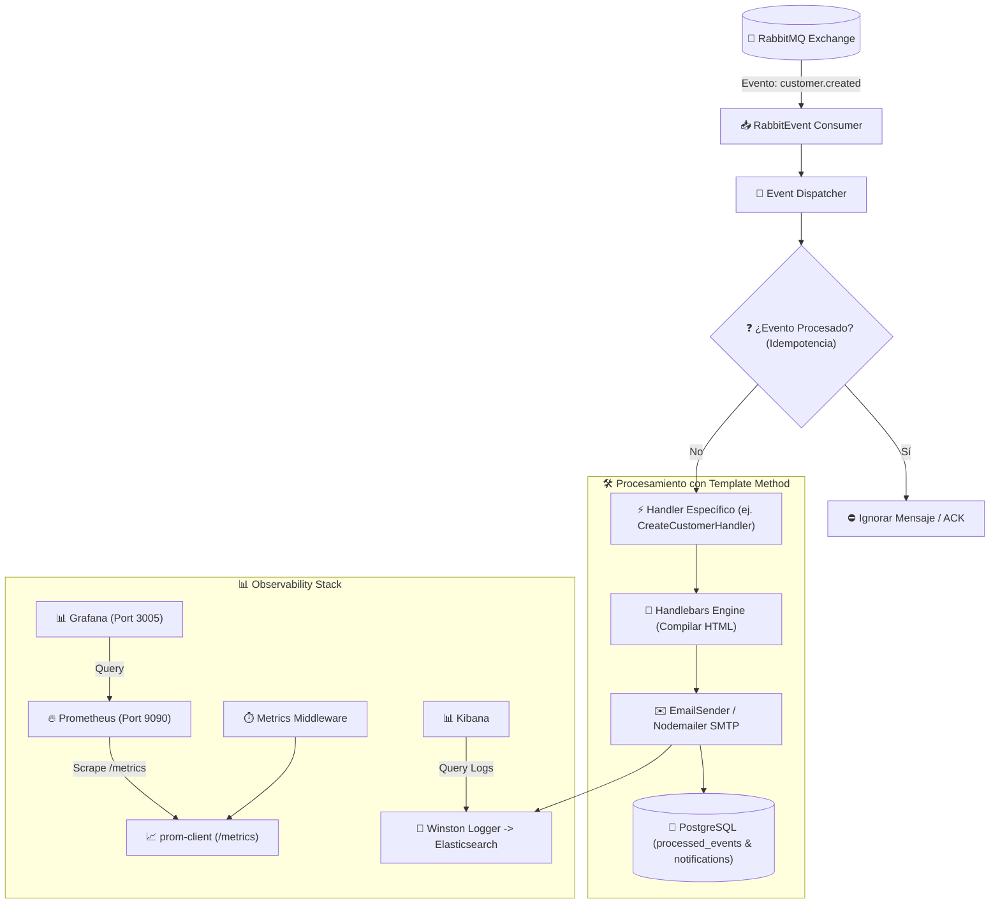
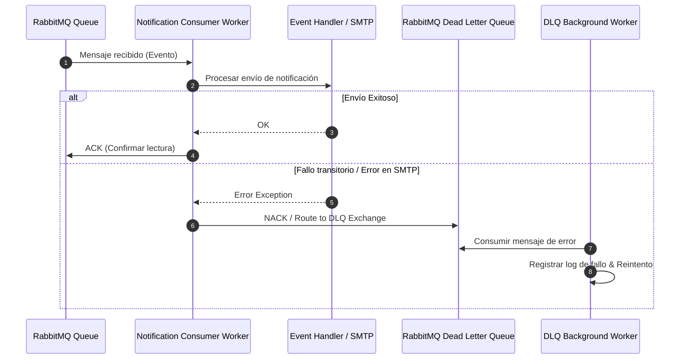

# 🔔 Notification Service - StreamCRM

Servicio asíncrono y reactivo orientado a eventos (**Event-Driven Architecture**) en **StreamCRM**. Su función principal es consumir eventos emitidos por otros microservicios (como `customer-service`) a través de **RabbitMQ** y gestionar el procesamiento y envío de notificaciones multicanal (**Email**, **SMS**) mediante plantillas HTML dinámicas (**Handlebars**), garantizando **idempotencia** y resiliencia con **Dead Letter Queue (DLQ)**, respaldado con observabilidad continua mediante **Prometheus** y **Grafana**.

---

## 📌 Tabla de Contenidos
- [Características Principales](#-características-principales)
- [Arquitectura del Microservicio](#-arquitectura-del-microservicio)
- [Diagramas de Arquitectura y Flujos](#-diagramas-de-arquitectura-y-flujos)
- [Estructura del Proyecto](#-estructura-del-proyecto)
- [Patrones de Diseño Implementados](#-patrones-de-diseño-implementados)
- [Eventos Manejados](#-eventos-manejados)
- [Rutas y API Endpoints](#-rutas-y-api-endpoints)
- [Monitoreo y Observabilidad](#-monitoreo-y-observabilidad)
- [Configuración y Variables de Entorno](#-configuración-y-variables-de-entorno)
- [Comandos y Ejecución](#-comandos-y-ejecución)

---

## ✨ Características Principales

- **Procesamiento Basado en Eventos**: Consumo asíncrono de RabbitMQ sin bloquear operaciones del cliente.
- **Notificaciones Multicanal**: Soporte extensible para envíos vía Email (**Nodemailer**) y SMS.
- **Motor de Plantillas Dinámicas**: Renderizado de mensajes HTML utilizando **Handlebars**.
- **Garantía de Idempotencia**: Verificación de eventos procesados en PostgreSQL (`processed_events`) para evitar notificaciones duplicadas.
- **Manejo Resiliente de Fallos (DLQ)**: Cola de mensajes fallidos (Dead Letter Queue) para auditoría y reintentos automatizados.
- **Observabilidad y Métricas (Prometheus & Grafana)**: Recolección y exposición de métricas del sistema y peticiones HTTP a través de `prom-client` en el endpoint `/metrics`.
- **Trazabilidad y Log Centralizado**: Envío de logs estructurados a **Elasticsearch** / **Kibana** mediante **Winston**.

---

## 🏗️ Arquitectura del Microservicio

El servicio opera principalmente como un **Event Consumer / Background Worker** que responde a eventos del sistema y expone métricas HTTP:

```text
┌──────────────────────────────────────────────────────────┐
│                   RabbitMQ Message Queue                 │
│         (Exchanges: crm.events / Queue: notifications)   │
└────────────────────────────┬─────────────────────────────┘
                             │
                             ▼
┌──────────────────────────────────────────────────────────┐
│                   RabbitMQ Event Consumer                │
│            (RabbitEventConsumer / DLQ Consumer)          │
└────────────────────────────┬─────────────────────────────┘
                             │
                             ▼
┌──────────────────────────────────────────────────────────┐
│                 Event Dispatcher & Handlers              │
│       (Template Method Pattern: BaseNotificationHandler) │
└────────────────────────────┬─────────────────────────────┘
                             │
                 ┌───────────┴───────────┐
                 ▼                       ▼
┌───────────────────────────────┐ ┌─────────────────────────┐
│     Template Engine           │ │   Notification Senders  │
│   (Handlebars Compiler)       │ │  (EmailSender / SMS)    │
└───────────────────────────────┘ └─────────────────────────┘
```

---

## 📐 Diagramas de Arquitectura y Flujos

### 1. Diagrama del Flujo Event-Driven, Envíos y Monitoreo



### 2. Diagrama de Manejo de Errores y DLQ (Dead Letter Queue)



---

## 📂 Estructura del Proyecto

```text
src/
├── app.ts                  # Configuración de Express para endpoints de salud (/health) y métricas (/metrics)
├── main.ts                 # Bootstrap del servicio y arranque de workers de RabbitMQ
├── background/             # Workers en segundo plano (events, notifications, dlq)
├── config/                 # Configuración de entorno, Nodemailer, PostgreSQL, Elastic, RabbitMQ
├── consumer/               # Consumidores de colas de RabbitMQ (Normal & DLQ)
├── controllers/            # Controladores HTTP (MetricsController, etc.)
├── dto/                    # Data Transfer Objects
├── entity/                 # Entidades del dominio (Notification, ProcessedEvent)
├── enum/                   # Enums (NotificationType, Channel, EventTypes, NotificationCommand)
├── handlebars/             # Helpers y utilidades para compilación de Handlebars
├── handlers/               # Event Handlers (CreateCustomer, UpdateCustomer, DeleteCustomer, StatusChange)
├── interfaces/             # Interfaces y contratos del servicio
├── publisher/              # Publicadores de eventos secundarios
├── repository/             # Persistencia de eventos procesados y notificaciones
├── routes/                 # Rutas de Express (metrics, etc.)
├── sender/                 # Adaptadores de envío (EmailSender via Nodemailer, SmsSender)
├── services/               # Servicios principales (Delivery Processing, Consumer Service, MetricsService)
├── shared/                 # Middlewares, utilidades, logger y manejador de errores
└── templates/              # Plantillas HTML Handlebars para emails
```

---

## 🧩 Patrones de Diseño Implementados

1. **Event-Driven Architecture (EDA)**: Desacoplamiento total entre servicios mediante publicación/suscripción asíncrona.
2. **Template Method Pattern (`BaseNotificationEventHandler`)**: Define el algoritmo esqueleto de procesamiento de notificaciones:
   - Validar idempotencia.
   - Renderizar la plantilla con datos del evento.
   - Ejecutar el envío mediante el canal adecuado.
   - Registrar la notificación y marcar el evento como procesado.
3. **Idempotent Consumer**: Garantiza que el procesamiento repetido del mismo evento no genere notificaciones duplicadas al usuario.
4. **Dead Letter Queue (DLQ)**: Aislamiento de mensajes no procesables para evitar el bloqueo de la cola principal.
5. **Observability Pattern (Prometheus Integration)**: Middleware e instrumentalización mediante `prom-client` para rastrear latencias de endpoint y métricas de proceso.

---

## 🔔 Eventos Manejados

| Evento | Descripción | Canal por Defecto |
| :--- | :--- | :--- |
| `customer.created` | Bienvenida al nuevo cliente registrado | Email |
| `customer.status_changed` | Notificación de cambio de estado (ej. Bloqueado / Inactivo) | Email |
| `customer.updated` | Confirmación de actualización de datos de perfil | Email |
| `customer.deleted` | Notificación de eliminación de cuenta | Email |
| `tag.created` | Notificación interna de creación de etiqueta | Email |

---

## 🛣️ Rutas y API Endpoints

### 📊 Métricas y Observabilidad (`/metrics`)
- `GET /metrics` - Exposición de métricas en formato Prometheus (`prom-client`).

### 🩺 Healthcheck
- `GET /health` - Estado de salud del microservicio de notificaciones.

---

## 📊 Monitoreo y Observabilidad

El microservicio está instrumentado con **Prometheus** y **Grafana**:

1. **Métricas por Defecto (`collectDefaultMetrics`)**:
   - Estadísticas del proceso Node.js (CPU, Heap usado/total, RSS, Event Loop delay).
   - Uso de memoria por Garbage Collector y sockets de red activos.

2. **Métricas Personalizadas**:
   - `http_requests_total`: Contador total de peticiones HTTP en el servicio con etiquetas de método, ruta y código de estado.
   - `http_request_duration_seconds`: Histograma de tiempo de respuesta de peticiones HTTP en segundos.

3. **Arquitectura de Métricas en Docker**:
   - **Prometheus Container (Puerto `9090`)**: Scrapea `http://host.docker.internal:3001/metrics` cada 5 segundos según la configuración en `prometheus.yml`.
   - **Grafana Container (Puerto `3005`)**: Permite la visualización de paneles en tiempo real para alertamiento y rendimiento del servicio.

---

## ⚙️ Configuración y Variables de Entorno

Crear un archivo `.env` en la raíz de `apps/notification-service/`:

```env
NODE_ENV=development
SERVER_PORT=3001

# PostgreSQL
DB_HOST=localhost
DB_PORT=5433
DB_USER=streamCRMServerAdmin
DB_PASSWORD=admin
DB_NAME=postgres

# RabbitMQ
RABBITMQ_URL=amqp://localhost:5673

# Nodemailer / SMTP Email Config
SMTP_HOST=smtp.mailtrap.io
SMTP_PORT=2525
SMTP_USER=tu_usuario_smtp
SMTP_PASS=tu_password_smtp
EMAIL_FROM=no-reply@streamcrm.com

# Elasticsearch
ELASTICSEARCH_NODE=http://localhost:9200
```

---

## 🚀 Comandos y Ejecución

```bash
# Navegar al microservicio
cd apps/notification-service

# Ejecutar en modo desarrollo (inicia workers de escucha)
pnpm dev

# Compilar TypeScript a JavaScript
pnpm build

# Iniciar servidor compilado en producción
pnpm start

# Ejecutar tests unitarios e integración
pnpm test
```
